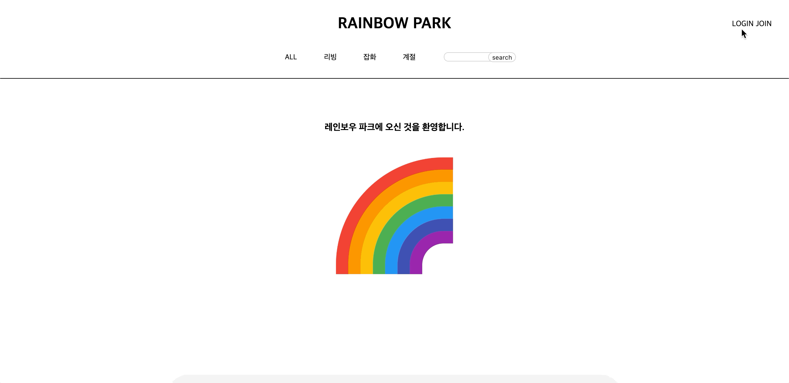
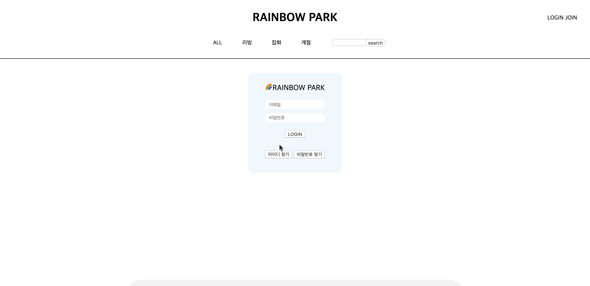
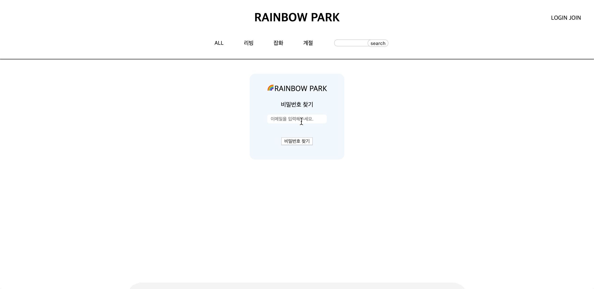
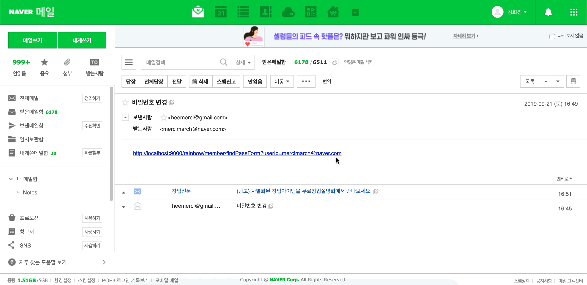
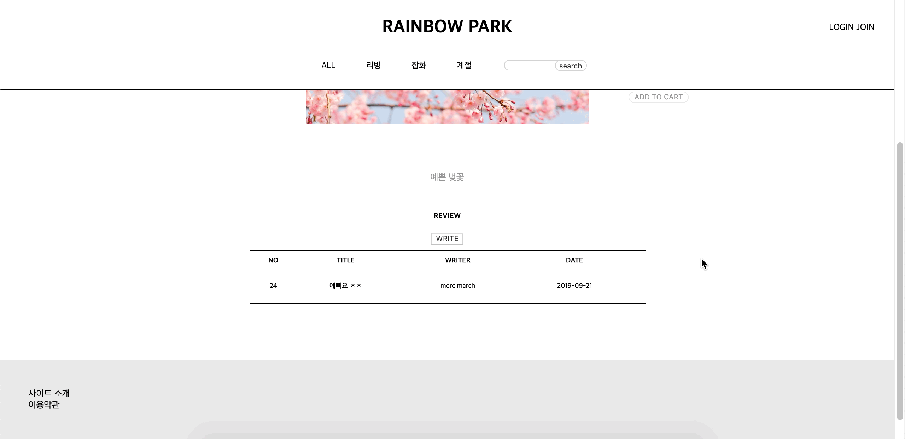

# Rainbow

# 환경설정
언어 : JAVA 8

프레임워크 : Spring 4.3.11

서버 : Apache Tomcat 8.5

데이터베이스 : Oracle 11g

기타기술 : JavaScript

운영체제 : MacOS

# 구현기능
- 회원가입 / 로그인
- 카테고리별 상품 목록
- 키워드 검색
- 상품 상세 페이지
- 장바구니
- 주문하기 / 주문 목록
- 상품 후기 / 댓글
- 상품 등록
- 회원 목록

# 프로젝트 규모
DB
- 테이블 8개 (총 컬럼 51개)
- 사용된 쿼리 44개

Source
- Controller Class 4개
- DTO (Data Transfer Object) Class 11개 - Service Class 3개
- DAO (Data Access Object) Class 3개
- Mapper Class 3개
- View (JSP File) 30개

 
 
 

# *회원가입*
: 폼 유효성 검사 후 패스워드는 BCrypt를 이용해 암호화하여 DB에 저장됨
 
 

 
 
 

# *로그인*
: 입력한 이메일을 이용해 패스워드를 가져온 후 로그인 폼에 입력한 패스워드와 DB에 저장된 패스워드를 비교하여 로그인
 
 

 
 
 

# *아이디 찾기*
: 회원가입시 입력한 닉네임과 연락처로 DB 검색 후 값이 있을시 값에 해당하는 이메일 출력
 
 

 
 
 

# *비밀번호 찾기 / 변경*
: 입력한 이메일이 회원 테이블에 있을시에만 JavaMail을 통해 비밀번호를 변경하는 폼을 메일로 발송
 
 

 
 

<<strong> 메일로 넘어온 폼을 통해 비밀번호 변경 </strong>>
  - 회원가입할 때와 마찬가지로 유효성 검사 후 변경
 
 

 
 
 

# *카테고리별 상품 목록*
- 카테고리는 1차와 2차로 나뉨
- ‘리빙’ 카테고리를 클릭하면 하위 카테고리인 ‘컵’, ‘텀블러’의 상품이 모두 출력되고, ‘리빙’의 하위 카테고리인 ‘컵’ 클릭시 ‘컵’의 상품만 보여짐
 
 

 
 
 

# *키워드 검색*
- 키워드를 검색하면 해당 키워드가 들어간 상품만 출력
- 카테고리별 상품 목록과 같이 이미지나 상품 이름을 클릭하면 해당 상품의 상세 페이지로 넘어감
 
 

 
 
 

# *장바구니*
- 상품 상세 페이지에서 Ajax를 통해 장바구니에 담김
- 해당 상품이 이미 담겨있을 땐 중복 방지를 위해 수량만 업데이트
- 선택한 상품을 삭제, 구매
 
 

 
 
 

# *주문하기*
- 장바구니에서 선택한 상품만 출력
- 주소 API를 이용해 우편번호와 주소를 입력하여 주문 진행
- 주문 완료한 상품은 장바구니에서 사라짐
 
 

 
 
 

# *주문 목록*
- 회원이 지금까지 주문한 주문 목록이 주문번호로 나뉘어서 출력
- 주문번호를 통해 해당 주문의 상세 정보 페이지로 이동
 
 

 
 
 

# *리뷰*
- 후기글의 제목을 클릭하면 해당 글의 내용과 댓글 리스트가 보여짐
- 해당 아이디로 주문한 상품만 후기글을 작성할 수 있으며 자신의 글에만 ‘수정’, ‘삭제’ 버튼이 보임
- 상품을 구매하지 않으면 리뷰를 등록 불가
 
 

 
 
<<strong> 구매하지 않았을 시 </strong>>

 
 
 

# *댓글*
- 개인정보보호로 회원의 닉네임과 댓글 내용, 날짜만 출력
- 댓글 기능 또한 비회원은 이용 불가
- ‘댓글은 로그인 후 이용 가능 합니다.’의 ‘로그인’에 로그인 페이지 링크를 걸어둬서 바로 이동 가능
 
 

 
 

<<strong> 로그인 안 했을 때 </strong>>
 
 

